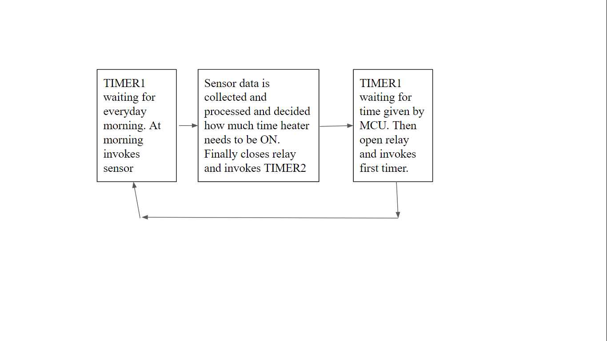

## COMPONENTS
Relay - to close the circuit between source and heater controlled by Atmega 328 as we cannot power heater with MCU
Atmega 328 - To process Sensor data and control Relay accordingly
LM35 - Temperature sensor output voltage is proportional to Temperature
## SIMULATION
- Since LM35 is not available we use a potentiometer to mimic anlog signals from LM35
- In reality timer need to count hours for easy of simulation time 1min represents 23hrs and 30s,15s represents 20min, 10min respectively

